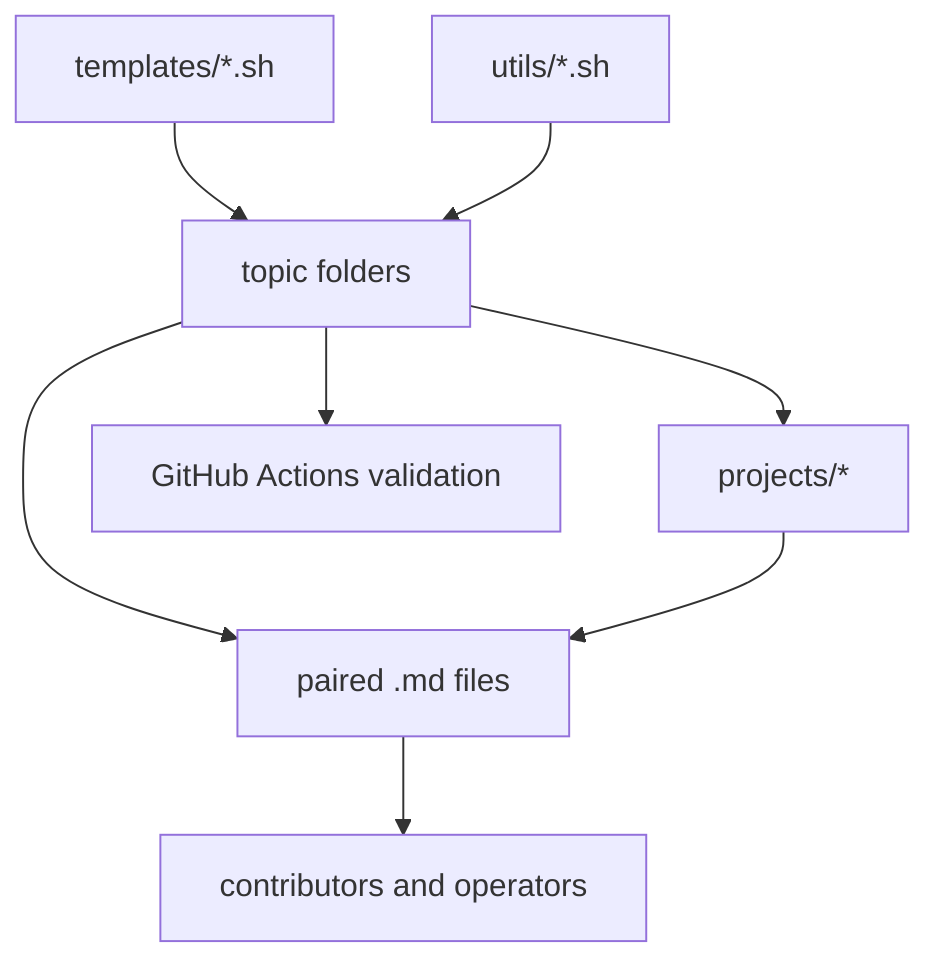

# Repository Architecture

The repository is intentionally layered so operational scripts stay simple while shared logic remains centralized.

Key design decisions:

- Shared utilities handle logging, validation, and retry semantics.
- Topic folders model operational domains instead of syntax levels.
- Projects show how individual scripts compose into larger delivery systems.
- Documentation is kept close to each script to reduce drift.
