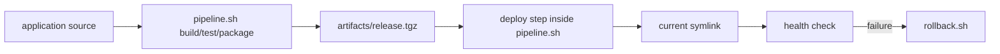

# Mini CI/CD Pipeline

This project shows how a Bash-first pipeline can build, test, package, deploy, and roll back an application artifact using a versioned release directory layout.

## Architecture



## Files

- `pipeline.sh`: Runs build, test, package, deploy, and optional health verification.
- `rollback.sh`: Re-points the live symlink to the previous release.
- `env/example.env`: Sample configuration values for the project.

## Quick Start

```bash
cp projects/mini-ci-cd/env/example.env .env
./projects/mini-ci-cd/pipeline.sh --app-dir /srv/myapp --build-cmd "make build" --test-cmd "make test" --package-dir dist
```
