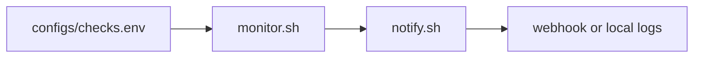

# Monitoring and Alert System

This project is a lightweight monitoring loop for hosts or small services. It evaluates checks described in a config file and dispatches alerts through a webhook helper.

## Architecture

## Files

- `monitor.sh`: Reads configured checks and evaluates them.
- `notify.sh`: Sends a structured alert payload.
- `configs/checks.env`: Sample check definitions.
