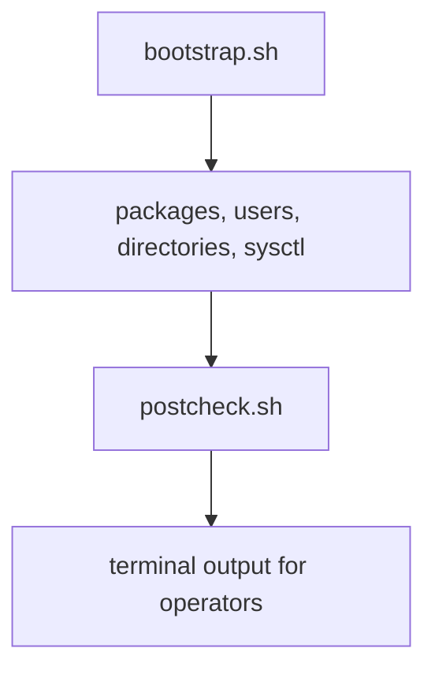

# Automated Server Setup

This project provisions a baseline Linux host for application workloads using Bash only. It installs packages, creates a deploy user, prepares directories, applies optional sysctl settings, and validates the result.

## Architecture

## Files

- `bootstrap.sh`: Performs package installation and baseline host setup.
- `postcheck.sh`: Verifies users, directories, and service readiness.
- `configs/sysctl.conf`: Example kernel tuning file to apply during bootstrap.
